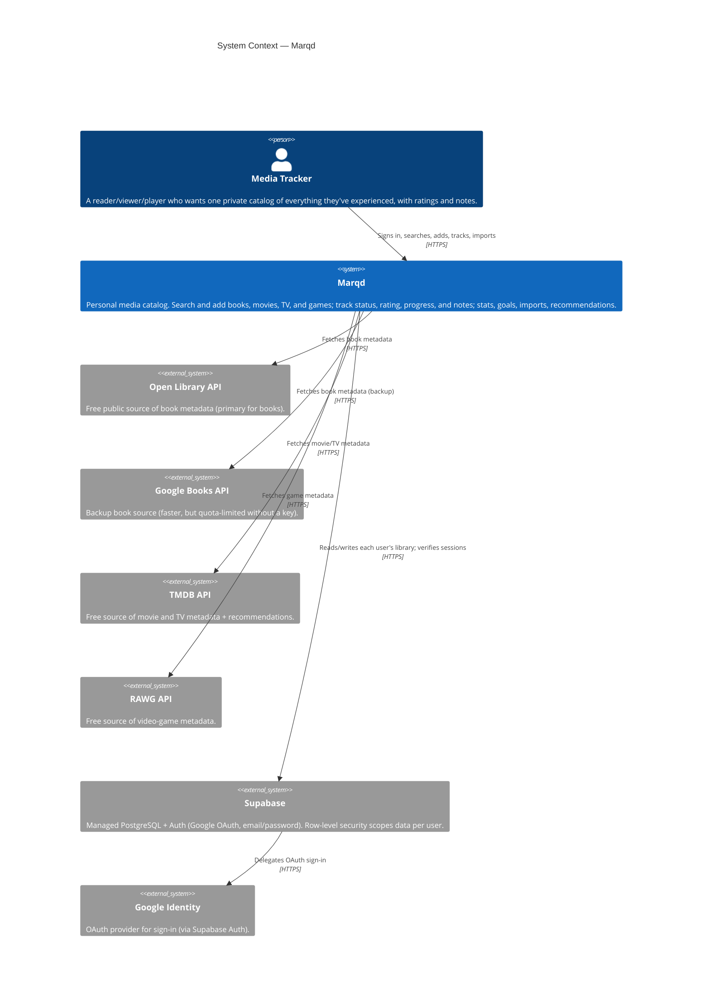
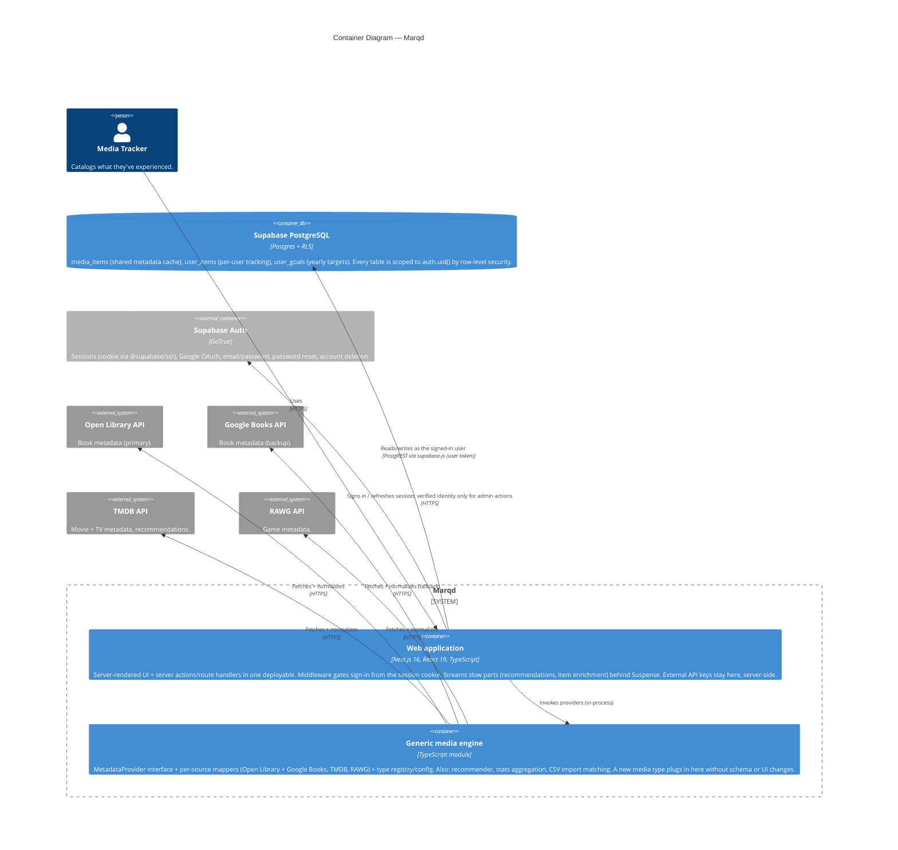

# Marqd — Architecture

This document describes Marqd's architecture using the [C4 model](https://c4model.com/).
Diagrams are kept as **Mermaid** in Markdown so they render natively on GitHub and stay
version-controlled as text. Keep them consistent with `README.md` §2 and with the Architecture
Decision Records in [`docs/adr/`](adr/). A stale diagram is worse than none — update it whenever
the architecture changes.

Currently maintained levels:

- **Level 1 — System Context:** Marqd as a black box among its users and external systems.
- **Level 2 — Container:** the runnable/deployable pieces and how they talk.

Level 3 (Component) diagrams are added only where the detail earns its place — most likely the
generic media engine, once it grows enough internal structure (registry, per-type config,
multiple providers).

---

## Level 1 — System Context

Who and what Marqd interacts with. Marqd lets each person catalog everything they've read,
watched, and played; it is a personal catalog, not a social network.

**Notes**

- All metadata sources are free/public APIs. All external calls and any credentials stay
  server-side (in server actions / route handlers), never in the browser.
- Media types are pluggable: each external metadata source is reached through the same
  provider interface (see [ADR 0002](adr/0002-generic-media-engine.md)). Books use a composite
  provider — Open Library primary, Google Books backup ([ADR 0012](adr/0012-book-provider-open-library-primary-google-books-backup.md)).
- Multi-user: Supabase Auth issues the session; every database call carries the user's token and
  RLS enforces ownership ([ADR 0009](adr/0009-supabase-auth-multi-user.md)). Request identity on
  the hot path is read from the session cookie, not a per-request auth round-trip
  ([ADR 0010](adr/0010-cookie-session-identity-no-per-request-auth-roundtrip.md)).

---

## Level 2 — Container

The runnable/deployable units. Marqd is a single Next.js application deployed on Vercel; the
database and auth are managed Supabase services. There is no self-hosted infrastructure
(see [ADR 0003](adr/0003-managed-services-no-docker.md)).

**Notes**

- **One deployable:** unlike a split frontend/backend, the Next.js app is both. Server actions
  and route handlers run server-side and are where provider calls and DB access happen.
- **CI/CD (outside the boundary):** GitHub Actions runs quality gates and security scans on every
  push; **Vercel** builds and deploys the app from Git (preview on PRs, production on merge to
  `main`) — see [ADR 0006](adr/0006-deployment-via-vercel.md).
- **Data layer:** `media_items` is global/shared metadata; `user_items` is the personal tracking
  record; `user_goals` holds yearly targets ([ADR 0011](adr/0011-stats-and-yearly-goals.md)).
  RLS is the security boundary — the app never relies on client-supplied identity for
  authorization ([ADR 0008](adr/0008-enable-rls-deny-by-default.md), [ADR 0010](adr/0010-cookie-session-identity-no-per-request-auth-roundtrip.md)).
- **Latency budget:** one Supabase round-trip from Vercel costs ~80–190 ms. Pages and actions are
  designed to make exactly one (the data call) — no auth round-trips on the hot path, slow
  provider calls streamed or time-boxed, `loading.tsx` on every data route.

---

## Level 3 — Component

Not yet maintained. When the generic media engine grows enough internal structure (registry,
per-type config, several providers with shared normalization), add a Level 3 component diagram
for it here.

---

## Change log

- **2026-09-05** — Multi-user reality: Supabase Auth + RLS, cookie-derived identity (ADR 0010),
  Google Books backup provider (ADR 0012), `user_goals` (ADR 0011), streaming/latency notes.
- **2026-08-28** — Initial C4 Level 1 (System Context) and Level 2 (Container) diagrams created
  alongside the project scaffold and documentation standards.
