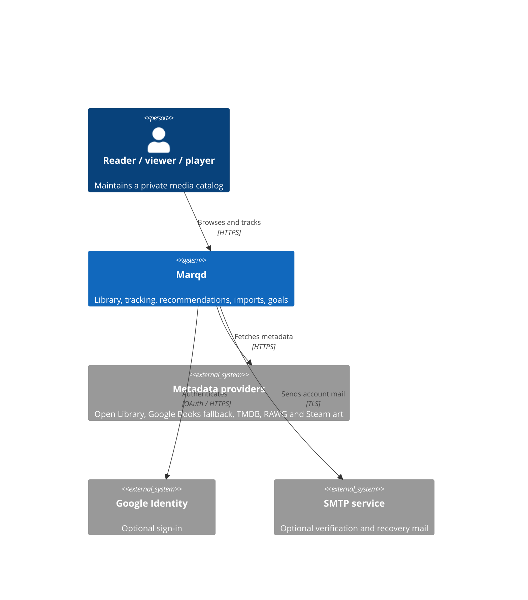
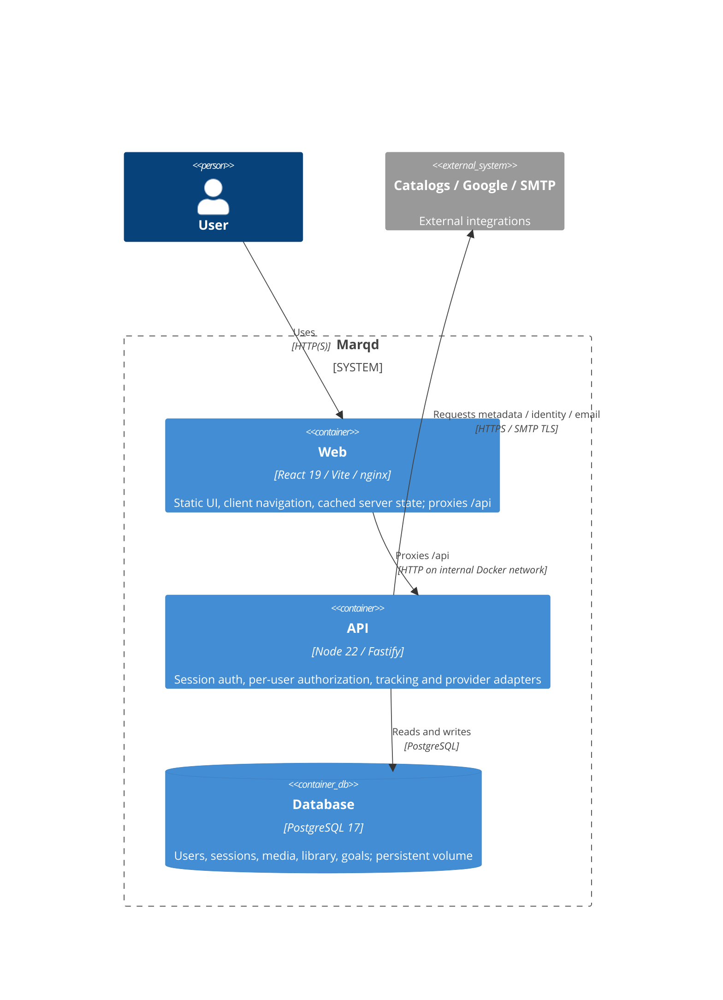

# Marqd — Architecture

The application runs as three portable containers. Legacy Next.js/Supabase architecture
is available in the `legacy-v1` tag; ADR 0018 records promotion of the replacement.

## C4 Level 1 — System context

```mermaid
C4Context
  Person(user, "Reader / viewer / player", "Maintains a private media catalog")
  System(marqd, "Marqd", "Library, tracking, recommendations, imports, goals")
  System_Ext(catalogs, "Metadata providers", "Open Library, Google Books fallback, TMDB, RAWG and Steam art")
  System_Ext(google, "Google Identity", "Optional sign-in")
  System_Ext(smtp, "SMTP service", "Optional verification and recovery mail")
  Rel(user, marqd, "Browses and tracks", "HTTPS")
  Rel(marqd, catalogs, "Fetches metadata", "HTTPS")
  Rel(marqd, google, "Authenticates", "OAuth / HTTPS")
  Rel(marqd, smtp, "Sends account mail", "TLS")
```

## C4 Level 2 — Containers

```mermaid
C4Container
  Person(user, "User")
  System_Boundary(system, "Marqd") {
    Container(web, "Web", "React 19 / Vite / nginx", "Static UI, client navigation, cached server state; proxies /api")
    Container(api, "API", "Node 22 / Fastify", "Session auth, per-user authorization, tracking and provider adapters")
    ContainerDb(db, "Database", "PostgreSQL 17", "Users, sessions, media, library, goals; persistent volume")
  }
  System_Ext(external, "Catalogs / Google / SMTP", "External integrations")
  Rel(user, web, "Uses", "HTTP(S)")
  Rel(web, api, "Proxies /api", "HTTP on internal Docker network")
  Rel(api, db, "Reads and writes", "PostgreSQL")
  Rel(api, external, "Requests metadata / identity / email", "HTTPS / SMTP TLS")
```

Shared schemas and media configuration live in `packages/contracts`. The API checks ownership
for private data. The browser uses HttpOnly cookie sessions and TanStack Query, with optimistic
updates and failure recovery. Provider requests do not gate navigation or saved-library browsing.

Only the web port is published by default. The operator supplies TLS/reverse proxy configuration,
backups, and integration credentials. See [container operations](CONTAINERS.md).
